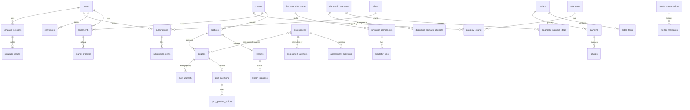

# Database Design

Canonical migrations: `backend/database/migrations` — **139 tables**.
Top-level `database/` holds only this pointer (kept for tooling).

## Seeder runbook

```bash
php artisan migrate --seed        # default: roles + subscription features + assessment
php artisan db:seed --class=ExampleCourseSeeder   # local dev demo course + users
```

| Seeder | What | Safe in prod |
|---|---|---|
| `RolePermissionSeeder` | roles + permissions (canonical) | yes |
| `SubscriptionFeaturesSeeder` | plan feature flags (`updateOrCreate`) | yes |
| `AutomotiveAssessmentSeeder` | demo quiz + final assessment on first course; **skips with warning** if none | yes |
| `ExampleCourseSeeder` | full demo course + `maya/samb` users | **local only** |

No simulator pack seeder exists yet — manifests fall back to the
`diagnostic_scenarios` graph (`SimulatorManifestService`). Seed packs via
`simulator_data_packs + simulator_components/pins/wires` when data arrives.

## Core ERD (Mermaid)



## Full table inventory (grouped)

- **Core LMS**: users, categories, category_course, courses, sections, lessons,
  enrollments, course_progress, section_progress, lesson_progress, lesson_notes,
  favorites, media, course_feedback, certificates, contact_messages.
- **Quizzes/assessments**: quizzes, quiz_questions, quiz_question_options,
  quiz_attempts, quiz_attempt_answers, quiz_attempt_answer_options, assessments,
  assessment_questions, assessment_quizzes, assessment_attempts,
  assessment_attempt_answers, assessment_attempt_answer_options,
  assessment_results, assessment_competencies, assessment_diagnostic_scenarios,
  competencies, competency_lesson.
- **Diagnostics**: diagnostic_scenarios, diagnostic_scenario_steps,
  diagnostic_scenario_hints, diagnostic_scenario_scoring_criteria,
  diagnostic_scenario_attempts, diagnostic_scenario_responses,
  diagnostic_scenario_results, diagnostic_scenario_step_results,
  diagnostic_hint_usages, course_diagnostic_scenarios,
  course_diagnostic_progress, diagnostic_attempt_events.
- **Simulator (15)**: simulator_data_packs, simulator_sessions, simulator_results,
  simulator_components, simulator_connectors, simulator_pins, simulator_nets,
  simulator_net_members, simulator_wires, simulator_locations,
  simulator_signal_definitions, simulator_faults, simulator_scenario_faults,
  simulator_tasks, simulator_rubrics.
- **Commerce**: plans, plan/policy feature tables (subscription_features,
  subscription_plan_features, subscription_items), subscriptions, orders,
  order_items, invoices, payments, payment_methods, payment_transactions,
  payment_provider_plans, payouts, purchases, refunds, transactions,
  webhook_events.
- **Growth**: student_progression_profiles, student_xp_transactions,
  user_achievements, student_competency_results,
  student_assessment_{results,responses,evidence,integrity_events,
  recommendations,preferences,scenario_paths}.
- **Comms**: message_conversations, message_participants, messages,
  support_tickets, support_ticket_replies, admin_broadcasts,
  student_notifications.
- **AI mentor**: mentor_conversations, mentor_messages, mentor_message_feedback,
  mentor_memories, mentor_ai_usages.
- **Platform**: vehicle_makes/models/variants, sessions, user_sessions,
  authentication_logs, audit_logs, security_events/incidents, incident_events,
  risks (+ risk_categories/controls/treatments/assessments/signals/evidence/
  reviews), feature_flags, one_time_passwords, recovery_codes,
  student_*_settings, cache(_locks), jobs/job_batches/failed_jobs,
  personal_access_tokens, password_reset_tokens.
